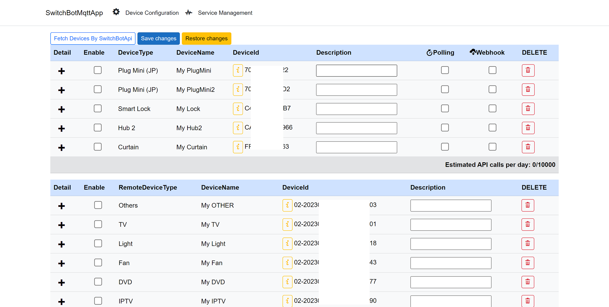
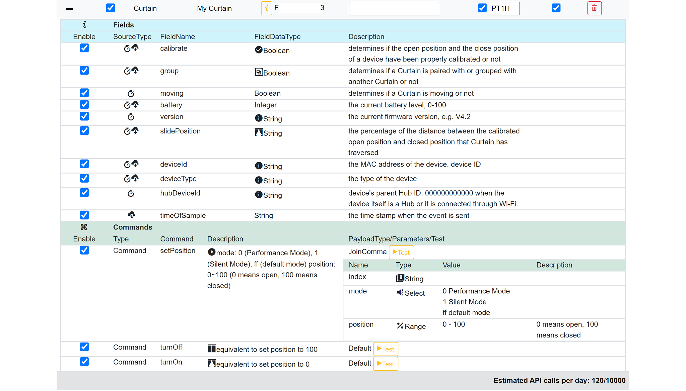
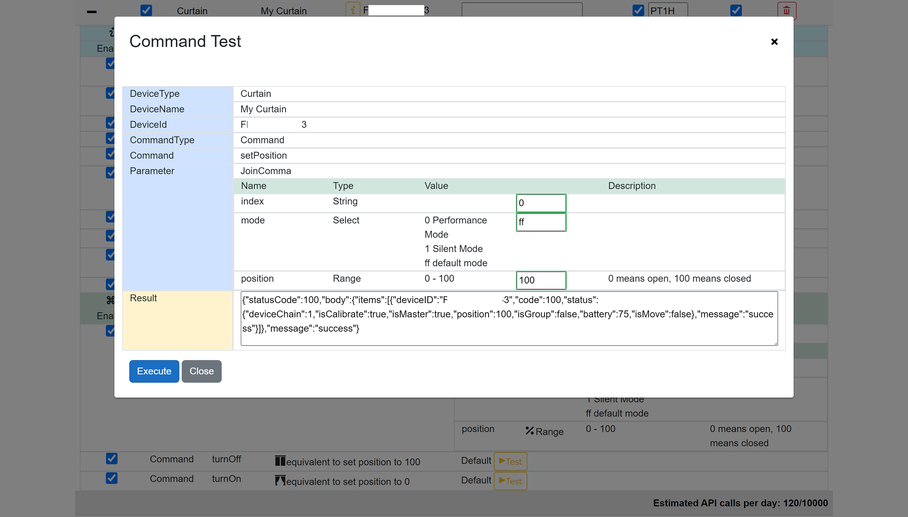
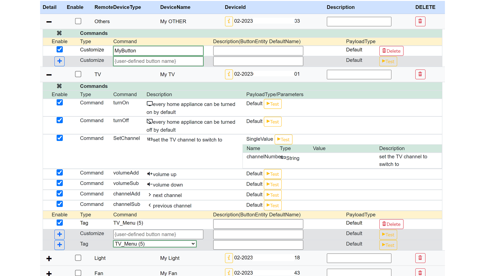
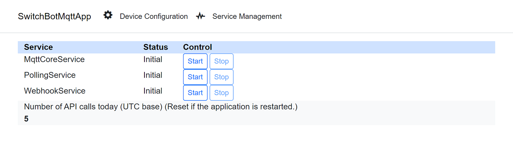
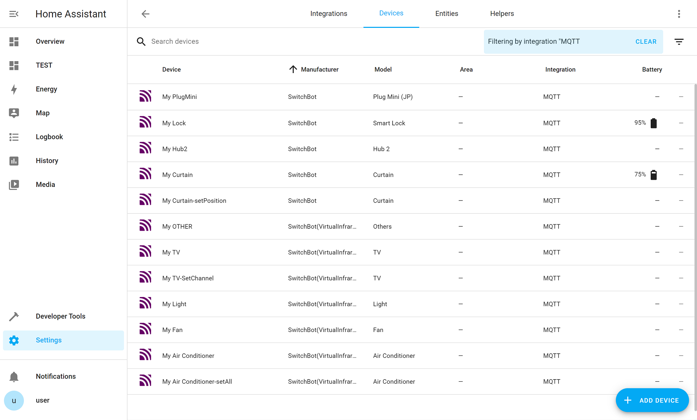
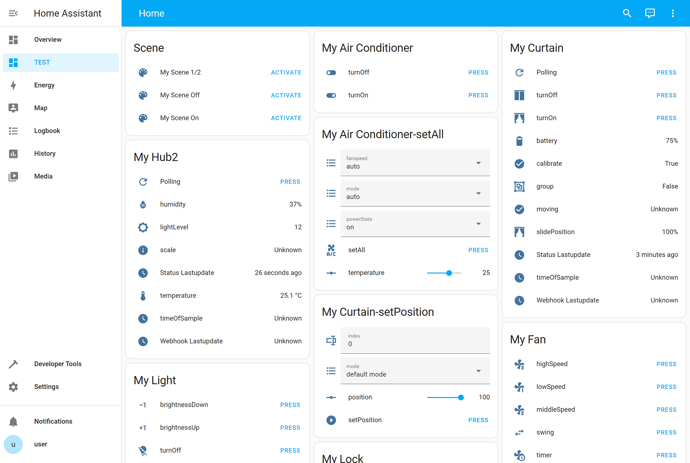

# Installation Method

## Install add-on

This add-on is implemented as a Blazor Server App using .NET 6 and has been verified to function across various environments.

### Add-on Installation On Home Assistant OS

1. Referencing the Docker Image Registered on GitHub Container Registry(recommended)
    1. [](https://my.home-assistant.io/redirect/supervisor_add_addon_repository/?repository_url=https%3A%2F%2Fgithub.com%2Fhsakoh%2Fha-addon)
        1. Navigate to the add-on store in the Home Assistant UI (Supervisor in the left menu, then Add-on Store on the top tab)
        1. Select the three vertical dots in the upper right-hand corner and select repositories
        1. In the Manage add-on repositories screen enter the URL for `https://github.com/hsakoh/ha-addon` and click add
        1. After adding the repository scroll to the bottom of the list of addons or use seach to find the addon
    1. Select the addon and click the Install
1. Pre-Compiling and Publishing the .NET App, then Building the Docker Image on HA-OS
    1. Execute `./_compile_self/dotnet_publish.ps1` at the root of the repository.
    1. Place the contents of the `_compile_self` folder into `HA-OS /addons/switchbot-mqtt`.
    1. Please check for updates on the Home Assistant add-on page and install add-on.
1. Compiling and Publishing the .NET App while Building the Docker Image on HA-OS
    1. Place the contents of both the `src` folder and `_build_on_haos` folder into `HA-OS /addons/switchbot-mqtt`.
    1. If the HA-OS machine is resource-limited, this method might lead to extended downtime while building (installing) processes occur. Not recommended.
    1. Please check for updates on the Home Assistant add-on page and install add-on.

### Running on a Separate Docker Container

1. Execute `./_compile_self/dotnet_publish.ps1` at the root of the repository.
1. Build the Docker image using the following command.

```powershell
docker build `
"./_compile_self" `
-t ghcr.io/hsakoh/switchbotmqtt-amd64:1.0.8 `
--build-arg BUILD_FROM="homeassistant/amd64-base:latest" `
--build-arg BUILD_ARCH="amd64" `
--progress=plain `
--label org.opencontainers.image.source=https://github.com/hsakoh/switchbot-mqtt
```

1. Configure the contents of `./_docker-compose/options_Example.json`, rename it to `options.json`.
1. Navigate to `./_docker-compose/` and run `docker compose up`.

### Running the Standard Blazor Server App with Kestrel

1. Open the solution file in Visual Studio and execute the application.
1. Configure the app setting to `appsettings.Development_Example.json`, and then rename it to `appsettings.Development.json`.

## Add-on Configuration

In simple terms, if you are using the Mosquitto add-on on Home Assistant OS, you just need to fill in the following three fields
* SwitchBot:ApiKey
* SwitchBot:ApiSecret
* WebhookService:NgrokAuthToken

|Setting Key |Default Value |Description|
|--|--|--|
|Mqtt:AutoConfig|`true`|For users of the default Home Assistant Mosquitto integration, connection details can be detected via the Home Assistant Supervisor API. Therefore, this value can be set to True|
|Mqtt:Host|-|MQTT Broker<br>Specify the hostname|
|Mqtt:Port|`1883`|Specify the port number.|
|Mqtt:Id|-|If authentication is required, specify the ID|
|Mqtt:Pw|-|If authentication is required, specify the PW.|
|Mqtt:Tls|`false`|If TLS connection is required, set to `true`.|
|SwitchBot:ApiKey|-|Obtain and configure the **open token** according to the [SwitchBotApi documentation](https://github.com/OpenWonderLabs/SwitchBotAPI#open-token-and-secret-key).The token is 96 characters long.|
|SwitchBot:ApiSecret|-|Obtain and configure the **secret key** according to the [SwitchBotApi documentation](https://github.com/OpenWonderLabs/SwitchBotAPI#open-token-and-secret-key).The secret is 32 characters long.|
|EnforceDeviceTypes[]:DeviceId|-|There are rare cases where devices, such as new ones, do not include the device type in their responses. In such cases, you can specify a device type to be forcibly recognized based on the device ID.|
|EnforceDeviceTypes[]:DeviceType|-|Same as above.|
|WebhookService:UseWebhook|`true`|If receiving Webhooks, set to true.|
|WebhookService:UseNgrok|`true`|If using Ngrok for Webhook reception, set to true.|
|WebhookService:NgrokAuthToken|-|If using Ngrok, set up the Ngrok authentication token.|
|WebhookService:HostUrl|-|This must be configured if Ngrok is not used. See details below.|
|AutoStartServices|`false`|If various internal services should start automatically when the add-on is started, set to true.|
|LogLevel|`Trace`|Set the log level. Specify one of the following values:<br>Trace, Debug, Information, Warning, Error, Critical, None|

If you have trouble saving `EnforceDeviceTypes`, try entering it on the YAML input screen in the following format.
```
EnforceDeviceTypes: []
```

## Webhook Reception

This add-on supports integration with [Ngrok](https://ngrok.com/) for webhook reception.

### Use Ngrok
* When configured, the add-on will internally download and install Ngrok, establish a session with Ngrok via outbound connections, and enable the capability to receive webhooks from SwitchBot by waiting for incoming connections.
* There is no need to open a port towards the internet.
* Before using Ngrok, carefully read its terms of use, sign up, obtain an authentication token, and configure it within the add-on.
* During the startup of the internal service for webhooks, Ngrok will be launched if configured, and the URL will be registered for the webhook using the [SwitchBot API](https://github.com/OpenWonderLabs/SwitchBotAPI#configure-webhook).

### Without using Ngrok
* To enable webhooks without using Ngrok, configure your environment so that the add-on's port 8098 can be accessed from the internet.
* The add-on itself will listen for requests at `http://<yourhost>:8098/webhook`.
* Please configure the URL in the settings, including the protocol, hostname, and port that are reachable from the internet in your environment, excluding `/webhook`.
* During the startup of the internal service for webhooks, use the SwitchBot API to register this URL for the webhook.

## Device Configuration

This add-on is support ingress, allowing you to open the configuration page by clicking "Open Web UI" from the add-on's page.
If running on a separate Docker instance, you can access the interface on port 8099.

* Once you've opened the configuration page, select "Device Configuration" from the top menu. This will take you to the device settings page.

* Clicking the `Fetch Devices By SwitchBotApi` button will list the physical devices and virtual infrared remote devices registered with SwitchBot. For more details, refer to the [API specifications](https://github.com/OpenWonderLabs/SwitchBotAPI#get-device-list).
* Click `Save changes` to persist the configuration.
* When you click 'Restore changes', the configuration values will revert back to their original state before opening the page.



### Physical Devices

The first table is used for configuring physical devices.

* Enabling the checkbox will make the corresponding device detectable by the MQTT integration.

* Enabling the Polling checkbox will result in notifying the device's status at specified intervals (in ISO8601 Duration format). [API specifications](https://github.com/OpenWonderLabs/SwitchBotAPI#get-device-status)
    * Since a button for manually retrieving the device status is sent to the MQTT integration, you can utilize it without automatic retrieval.
    * At the bottom of the table, you will find the expected number of API calls based on the current settings. Please consider this as a reference.
    * Currently, the limit is 10,000 API calls per day. You should aim for a value well below this threshold. Keep in mind that command operations also result in one API call per action, so set the frequency accordingly.



* Enabling the Webhook checkbox will lead to analyzing the content upon receiving a webhook, and subsequently notifying the device's status.
* Pressing the plus button will enumerate the field items and command items for the device.
* Enabling the checkbox will make the corresponding field items and command items detectable by the MQTT integration.

* The Source Type indicates the values obtainable through polling and webhook.
* Commands have a Test Execution button available, allowing you to execute the API directly from this screen and test its functionality.


### Virtual Infrared Remote Devices

There are no field items for virtual infrared remote devices.
You can configure default commands based on the RemoteDeviceType, as well as customizable commands.

* The default commands are displayed initially, but please note that they might not function as intended based on the custom settings in the SwitchBot app. It''s recommended to verify their functionality on this screen.
* For reference, refer to the [API specifications](https://github.com/OpenWonderLabs/SwitchBotAPI#send-device-control-commands) related to commands.



* Example payload for preset commands
`{"commandType":"command","command": "turnOn","parameter": "default"}`
`{"commandType":"command","command":"setPosition","parameter":"0,ff,70"}`

* Example payload for custom commands:
`{"commandType":"customize","command": "MyButtonName","parameter": "default"}`

* Example payload for tag commands
`{"commandType":"tag","command": "1","parameter": "default"}`

#### Differences Between Customize and Tags

Tag commands are not documented in the API specifications.
Buttons that users have added arbitrarily in the SwitchBot app can be executed using `customize` by specifying their names.
Default operation buttons when a device is detected in the SwitchBot app or selected from the device list seem to be operable with this `tag` command type.
KeySet attempts to enumerate appropriate values as presets, but it may not cover all possibilities.
Try specifying various numerical values to achieve the desired behavior.

(Based on a limited range of testing, it seems that the buttons are assigned sequentially from the top left of the screen, with smaller numbers assigned first. Region-specific keys seem to have higher numbers assigned to them, such as specific keys for Japanese TVs.)

### Miscellaneous

* By setting a value in the Description field, you can overwrite the name of the device detected on Home Assistant from DeviceName.

* Deleting on this screen will only make it invisible in the add-on. It will not be removed from the SwitchBot app.
You can restore it by performing 'Fetch Devices By SwitchBotApi' again.
This functionality is intended to facilitate maintenance when commands or fields are added due to upgrades of the internal configuration file (CSV master).

## Starting the Services

This add-on internally operates three services.



|Service|Description|
|--|--|
|MqttCoreService|The main functionality involves connecting to the MQTT broker, reading device configurations, building and sending Entity configuration information, and subscribing to command processing.|
|PollingService|This service retrieves device information at configured intervals for each device and sends the status to the MQTT broker.|
|WebhookService|Launch Ngrok and registers the Webhook URL with the SwitchBot service.|

Additionally, it runs as an ASP.NET Core Web application with a Webhook endpoint and hosts the BlazorServer of this configuration app itself.

Once device configuration is complete, start the services.
The PollingService cannot be started until the MqttCore service is up and running.
The Webhook service requires activation when using Webhooks, even if Ngrok is not utilized, as registration through the SwitchBotAPI is necessary.

Once device configuration is complete and you have verified proper functionality, it''s recommended to enable the AutoStartServices in the add-on configuration.





As evident from the above screen, in the current add-on, commands with parameters are implemented in a way that they are detected as separate devices by the MQTT integration. This was done because the intention was to represent parameters as a single command in the default created card.
